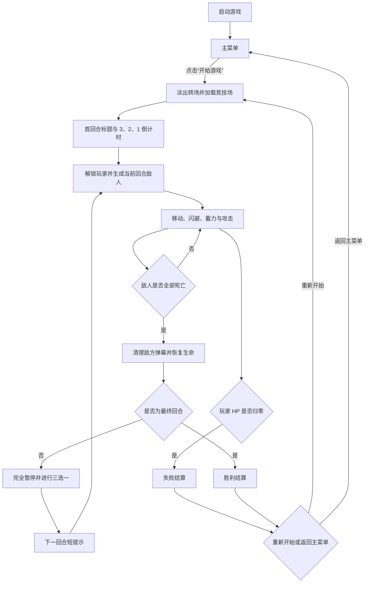

# ScaleSword：GameJam 策划与开发规格

> 版本：v0.2  
> 日期：2026-07-18  
> 引擎：Godot 4.7  
> 类型：地下城俯视角肉鸽动作游戏  
> 主题：Scale  
> 单局目标时长：10–15 分钟  
> 美术规格：固定资源包，8×8 像素风

## 1. 游戏概述

ScaleSword 是一款在单张地下城竞技场内展开的俯视角动作肉鸽。玩家使用 WASD 移动、鼠标瞄准，通过按住鼠标左键让武器持续变大，并在合适的时机释放挥砍。

武器尺寸不是单纯的伤害倍率，而是整个战斗决策的核心：

- 更大的剑拥有更高伤害、更远攻击范围和更强击退。
- 蓄力期间剑越大，玩家移动速度越慢。
- 剑越大，挥砍速度越慢，攻击后暴露的时间越长。
- 武器尺寸越大，命中停顿、镜头抖动、粒子和声音反馈越强。

核心体验可以概括为：

> 小剑灵活、快速、安全；大剑缓慢、危险，但能覆盖战场、击退敌群并带来更强烈的命中反馈。

## 2. 设计支柱

### 2.1 尺寸同时代表收益与风险

尺寸必须同时改变伤害、范围、玩家机动性、挥砍速度和表现反馈，不能退化为普通的“长按增加伤害”。

### 2.2 高威胁攻击必须可读

敌人的冲刺、瞬移落点、大范围攻击和高伤害弹幕必须提供明确预警。玩家死亡应该来自判断或操作失误，而不是无法识别的攻击。

### 2.3 小剑与大剑都能形成流派

升级系统同时支持：

- 小尺寸、高攻速、连续攻击的轻剑流。
- 大尺寸、高伤害、范围控制的重剑流。
- 闪避、生存、蓄力防护等辅助流派。

“永远蓄满”不能成为唯一正确答案。

### 2.4 反馈强度随尺寸增长

闪白、击退、命中停顿、镜头抖动、粒子和音效都随尺寸增长，但必须设置上限，避免满尺寸攻击造成画面失控或操作信息丢失。

## 3. 已确认的设计决定

| 项目 | 确定规则 |
| --- | --- |
| 玩家移动 | WASD |
| 瞄准 | 鼠标持续瞄准 |
| 蓄力与攻击 | 按住鼠标左键蓄力，松开后挥砍 |
| 取消蓄力 | 鼠标右键取消，随后进入 0.2 秒空档 |
| 闪避 | Space |
| 生命值 | 100 HP 数值制 |
| 最大蓄力 | 蓄满后允许无限持有，不自动释放 |
| 挥砍方向 | 挥砍开始时锁定，过程中不能改变 |
| 身体接触 | 接触敌人会受到伤害 |
| 分裂压制 | 足够大的剑直接击杀分裂怪时，可阻止其分裂 |
| 开场流程 | 启动后先进入主菜单；点击开始后经过转场与首回合倒计时才开始战斗 |
| 回合间升级 | 三选一界面打开时游戏完全暂停 |
| Boss 流程 | 两个 Boss 在同一局中依次出现 |
| 局外成长 | 不制作金币、商店或永久成长 |
| 画面风格 | 固定资源包的 8×8 像素风 |

## 4. 单局流程

推荐使用 9 个回合，使完整流程稳定控制在 10–15 分钟。



### 4.1 主菜单

游戏启动后只显示主菜单，不实例化正在运行的战斗，或将竞技场与战斗系统保持禁用状态。

主菜单首版包含：

- 游戏标题 `ScaleSword`。
- `开始游戏`按钮。
- 简短操作提示：WASD 移动、鼠标蓄力与攻击、右键取消、Space 闪避。
- `退出游戏`按钮；如果导出平台不适合主动退出，可隐藏该按钮。

主菜单背景可以使用静态地牢画面，也可以在背景中展示玩家持剑的轻微待机动画，但不能生成敌人或开始回合计时。

### 4.2 开战缓冲

点击`开始游戏`后按以下顺序进入战斗：

1. 主菜单淡出，建议转场时间约 0.25 秒。
2. 加载竞技场，将玩家放置在安全的初始位置。
3. 显示`第 1 回合`或`准备战斗`标题。
4. 显示 3、2、1 倒计时，每个数字保持 1 秒，首次开战总缓冲时间约 4 秒。
5. 缓冲期间不生成敌人，玩家不能移动、闪避、蓄力或攻击，但剑可以继续跟随鼠标瞄准，帮助玩家确认方向。
6. 显示`开始！`后解锁玩家输入，再开始生成敌人。

后续回合不需要重复完整的 3、2、1。完成三选一后显示约 1.0–1.5 秒的回合标题，再开始生成敌人。

10–15 分钟的单局计时从首回合显示`开始！`并进入 `COMBAT` 时开始，不包含玩家停留在主菜单的时间。

### 4.3 回合结束处理

每回合完成时：

1. 立即停止继续刷怪。
2. 在约 0.25 秒内清理或淡出残余敌方子弹。
3. 恢复玩家 15% 最大生命。
4. Boss 回合后可以提高为 25%，但不能超过最大生命。
5. 完全暂停战斗，展示三个升级选项。
6. 玩家选择强化后，显示下一回合短提示，再生成新一轮敌人。

不制作局外成长。本局失败后显示统计、`重新开始`和`返回主菜单`按钮。

### 4.4 全局流程状态

| 状态 | 说明 | 是否运行战斗 |
| --- | --- | --- |
| `MAIN_MENU` | 显示标题、操作提示和开始按钮 | 否 |
| `TRANSITION` | 菜单与竞技场之间淡入淡出 | 否 |
| `ROUND_INTRO` | 显示回合标题或首回合倒计时 | 否 |
| `COMBAT` | 玩家和敌人正常行动 | 是 |
| `UPGRADE` | 清场后的三选一界面 | 否，完全暂停 |
| `PAUSED` | 玩家主动打开暂停菜单 | 否 |
| `RESULT` | 胜利或失败结算 | 否 |

## 5. 操作与玩家状态

### 5.1 InputMap

| 输入 | 建议 Action 名称 | 行为 |
| --- | --- | --- |
| W | `move_up` | 向上移动 |
| A | `move_left` | 向左移动 |
| S | `move_down` | 向下移动 |
| D | `move_right` | 向右移动 |
| 鼠标位置 | 无需 Action | 计算世界坐标瞄准方向 |
| 鼠标左键 | `attack_charge` | 按住蓄力，松开释放 |
| 鼠标右键 | `attack_cancel` | 取消蓄力并进入 0.2 秒空档 |
| Space | `dodge` | 沿移动方向闪避 |
| Esc | `pause` | 打开暂停菜单 |

八方向移动向量必须归一化，避免斜向移动速度更快。

没有移动输入时按下闪避，优先沿最后移动方向闪避；如果还没有有效的最后移动方向，则沿鼠标瞄准方向的反方向闪避。

### 5.2 玩家状态机

| 状态 | 允许行为 | 退出条件 |
| --- | --- | --- |
| `MOVE` | 移动、瞄准、开始蓄力、闪避 | 收到蓄力、闪避或受伤事件 |
| `CHARGE` | 移动、转向、继续增长、右键取消 | 左键释放或取消 |
| `CANCEL_RECOVERY` | 低速移动 | 0.2 秒结束 |
| `SWING` | 低速移动，攻击方向锁定 | 挥砍与后摇结束 |
| `DODGE` | 锁定闪避方向，短暂无敌 | 闪避时间结束 |
| `HURT` | 短暂失控和受击闪烁 | 受击硬直结束 |
| `DEAD` | 禁用战斗输入 | 重新开始 |

蓄力期间使用闪避时，默认清空当前蓄力并立刻进入闪避，不保留已积累的尺寸。

## 6. 武器尺寸系统

### 6.1 基础计算

以下数值是第一轮可玩原型的调参基线，不是最终平衡结果。

```text
p = clamp(蓄力时间 / 蓄满时间, 0, 1)
q = p
S = 1 + (最大尺寸 - 1) × q
```

- `p`：蓄力进度。
- `q`：用于统一驱动其他效果的归一化尺寸进度。
- `S`：实际武器尺寸倍率。

首版采用线性尺寸增长，让玩家能够准确预估释放时机。后续升级可以改变最大尺寸或蓄满时间。

### 6.2 初始数值

| 属性 | 初始值或公式 | 说明 |
| --- | --- | --- |
| 玩家基础移动速度 | 70 world px/s | 适配当前约 320×180 的摄影视野 |
| 最大生命 | 100 HP | 支持数值和百分比强化 |
| 最大武器尺寸 | `Smax = 3.0` | 满蓄力明显改变覆盖范围 |
| 蓄满时间 | 1.6 秒 | 敌人压力下需要承担风险 |
| 蓄力移速倍率 | `lerp(1.0, 0.45, q)` | 满蓄力仍可以缓慢调整位置 |
| 基础攻击伤害 | 20 | 约两次小剑攻击击杀基础近战怪 |
| 伤害倍率 | `0.65 + 0.35 × S^1.6` | S=1 时为 1；S=3 时约为 2.68 |
| 挥砍时长 | `lerp(0.22, 0.55, q)` 秒 | 大剑暴露时间更长 |
| 挥砍角度 | 140° | 能够清群，但不会直接覆盖整圈 |
| 取消硬直 | 0.20 秒 | 允许止损，但不能无成本试探 |
| 受伤无敌 | 0.80 秒 | 避免接触敌群时连续扣血 |
| 闪避时间 | 0.18 秒 | 包含启动、位移和恢复 |
| 闪避冷却 | 0.85 秒 | 后续根据弹幕密度调整 |
| 闪避速度 | 180 world px/s | 明显快于基础移动 |

### 6.3 命中规则

- 剑只在 `SWING` 状态启用伤害碰撞。
- `CHARGE` 状态只显示武器尺寸，不造成伤害。
- 每次挥砍对同一个敌人最多结算一次伤害。
- 每次挥砍维护独立的已命中目标集合，攻击结束后清空。
- 普通攻击默认不能清除敌方子弹。
- `弹丸粉碎`强化可以让达到尺寸阈值的剑摧毁普通子弹。
- 分裂怪受到 `S ≥ 2.3` 的致命攻击时直接粉碎，不再生成子体。

### 6.4 击退与反馈

| 尺寸范围 | 击退参考 | 命中停顿 | 镜头抖动 | 视觉反馈 |
| --- | --- | --- | --- | --- |
| `S < 1.5` | 约 22 world px/s | 0.025 秒 | 1–2 px，0.08 秒 | 短闪白、小粒子 |
| `1.5 ≤ S < 2.4` | 约 40–50 world px/s | 0.045 秒 | 2–3 px，0.11 秒 | 中粒子、明显拖影 |
| `S ≥ 2.4` | 约 70 world px/s | 0.070 秒 | 3–5 px，0.15 秒 | 强闪白、冲击环和碎片 |

大型敌人可以降低击退位移，但仍需播放受击形变、闪白和命中停顿。

## 7. 程序化动画规范

### 7.1 实现原则

所有 Rotation、Skew、Scale 和 Modulate 动画只作用在独立的 `VisualRoot` 上。

```text
Player (CharacterBody2D)
├── CollisionShape2D
├── VisualRoot (Node2D)
│   └── PlayerSprite (Sprite2D)
└── SwordPivot (Node2D)
	├── SwordHitbox (Area2D)
	└── SwordVisualRoot (Node2D)
		└── SwordSprite (Sprite2D，保留约 -45° 美术补偿)
```

重要约束：

- `CharacterBody2D` 和 `CollisionShape2D` 不随表现动画旋转或 Skew。
- 剑的实际瞄准角与贴图约 `-45°` 的美术补偿分层处理。
- 动画开始前保存 `base_transform`，结束后精确恢复。
- 不能在 `_process` 中每帧重新创建 Tween。
- 持续循环动画使用相位值计算；受伤、闪避、释放等短动画使用 Tween。

### 7.2 玩家待机与移动

| 情形 | 变换建议 | 节奏 |
| --- | --- | --- |
| 待机呼吸 | `Scale.y` 在 0.97–1.03 间往返 | 周期约 0.8 秒 |
| 常规移动 | Rotation ±3°；Skew ±0.04 rad；轻微上下弹跳 | 根据移动距离推进相位 |
| 横向转向 | 沿速度方向增加约 ±0.05 rad Skew | 平滑插值，不能瞬间翻转 |
| 蓄力移动 | 降低摆动频率，身体向剑的反方向倾斜 | 尺寸越大，倾斜越明显 |
| 受伤 | 短促 Rotation 抖动，Modulate 红/白闪烁 | 与受伤无敌计时同步 |

移动停止后必须平滑回到基础 Rotation、Skew 和 Scale，不能积累变换误差。

### 7.3 玩家闪避

建议将 0.18 秒闪避拆成三个动画阶段：

1. **启动，约 0.04 秒**
   - VisualRoot 沿闪避方向倾斜 18°–25°。
   - `Scale.x = 1.20`。
   - `Scale.y = 0.78`。

2. **位移，约 0.10 秒**
   - Skew 最高达到 0.12–0.16 rad。
   - 生成 2–3 个半透明残影。
   - 残影只复制当前贴图和视觉变换，不复制碰撞或脚本。

3. **恢复，约 0.04 秒**
   - Rotation、Skew 和 Scale 使用 ease-out 回到 `base_transform`。

建议无敌窗口覆盖闪避开始后的 0.03–0.16 秒。闪避结束前恢复受击判定，避免玩家看起来已经停下却仍处于无敌状态。

### 7.4 怪物蓄力与冲刺

| 阶段 | 表现 | 逻辑同步 |
| --- | --- | --- |
| 锁定 | Modulate 从原色过渡至浅黄，短暂停顿 | 记录目标方向 |
| 蓄力 | Scale 由 1.0 增至 1.15–1.45；Skew 左右震颤；颜色由黄转橙红 | 显示冲刺路径 |
| 释放前闪 | 约 0.06 秒白闪，Scale 短暂压缩 | 路径显示完成 |
| 冲刺 | 沿移动方向拉长，反方向压扁，生成残影 | 开启冲刺伤害 |
| 收尾硬直 | Rotation 回弹，Scale 过冲后归一，颜色恢复 | 关闭伤害，开放反击窗口 |

不同怪物的蓄力尺寸：

- 普通冲锋者：最大约 1.15。
- 重型冲锋者：最大约 1.35–1.45。
- Boss 长距离冲刺：根据阶段约 1.25–1.50。

## 8. 敌人阵容

普通怪暂定 6 种。每种怪只承担一种主要战斗压力，复杂度来自组合。

### 8.1 追猎者

- 建议属性：35 HP、30 world px/s、接触伤害 10。
- 持续追逐玩家。
- 击退抗性低。
- 主要作用是压缩玩家走位空间，鼓励使用大剑清群。

### 8.2 射手

- 建议属性：30 HP、24 world px/s、子弹伤害 9。
- 尝试与玩家保持中距离。
- 发射单发或三连发子弹。
- 射击前闪烁并短暂锁定方向。
- 被玩家接近时尝试后撤。

### 8.3 冲锋者

- 建议属性：60 HP、常规移速 20、冲刺伤害 18。
- 停止移动并锁定玩家。
- 一次性显示完整短距离路径。
- 约 0.45–0.55 秒后冲刺。
- 撞墙或冲刺结束后进入约 0.65 秒硬直。

### 8.4 重型冲锋者

- 建议属性：120 HP、冲刺伤害 25。
- 使用长距离分段路径预警。
- 蓄力期间身体逐渐变大。
- 冲刺路径宽度随身体尺寸增长。
- 击退抗性高。
- 冲刺结束后进入约 0.8 秒硬直。

### 8.5 游击射手

- 建议属性：50 HP、38 world px/s、子弹伤害 8。
- 横向绕玩家移动。
- 短冲刺后发射扇形弹幕。
- 冲刺和射击分别提供预警。
- 攻击后保留明显空档，不能连续冲刺。

### 8.6 分裂体

- 建议属性：65 HP。
- 正常死亡后生成两个 18 HP 的小型单位。
- 子体体型更小、速度更快。
- 被 `S ≥ 2.3` 的攻击直接击杀时触发粉碎，不生成子体。

### 8.7 通用规则

- 敌人不能在玩家半径 48 world px 内出生。
- 出生时进行约 0.4 秒淡入，并暂时禁用伤害。
- 敌人不能在屏幕外无预警向玩家开火。
- 接触伤害触发后，敌人自身也进入短暂接触冷却。
- 普通子弹初始速度控制在 45–75 world px/s。
- 敌人越出竞技场边界时优先返回场内。

## 9. 冲刺与危险路径预警

### 9.1 短距离预警

- 适用距离：约 24–64 world px。
- 一次性显示完整路径和冲刺终点。
- 显示宽度必须匹配实际碰撞宽度。
- 最低建议反应时间：0.45 秒。

### 9.2 长距离分段预警

- 适用于超过 64 world px 或穿越大半竞技场的冲刺。
- 路径从怪物脚下开始逐段延伸。
- 建议每 0.12 秒点亮一段。
- 路径延伸时怪物同步变大、颜色变暖、Skew 震颤增强。
- 路径全部显示后进行一次白闪，再发动冲刺。
- 最低建议总反应时间：0.85 秒。

### 9.3 表现规范

- 危险区域使用暖色半透明填充，并保留高对比边缘。
- 不能只通过红色和绿色区别危险状态。
- 怪物变大时，预警路径宽度同步增加。
- 攻击释放后路径迅速高亮并消失。
- 多个长距离预警需要错开时间，避免完全重叠。

## 10. Boss 设计

### 10.1 第 5 回合：虚空突击者

建议生命：450 HP。

该 Boss 用于检验玩家是否已经掌握完整路径、分段路径、瞬移落点和基础弹幕。

| 技能 | 预警 | 执行与反击窗口 |
| --- | --- | --- |
| 短距离冲刺 | 完整路径立刻出现，约 0.55 秒后释放 | 连续 1–2 次，结束后约 0.55 秒硬直 |
| 长距离蓄力冲刺 | 路径每 0.12 秒延伸一段，本体放大至约 1.35 | 路径完成后白闪，结束后约 0.8 秒硬直 |
| 瞬移 | 原地残影加目标落点圆环，至少 0.45 秒 | 落点后短暂停顿，不能直接无预警撞击 |
| 环形或扇形弹幕 | 身体中心高亮，外圈出现方向提示 | 必须保留至少一条明显安全通道 |
| 半血组合 | 保留每个技能原本的预警 | 瞬移→弹幕→长冲刺，组合后有较长空档 |

阶段划分：

- 100%–50% HP：技能单独使用，建立识别。
- 50%–0% HP：开始组合瞬移、弹幕和冲刺，但不能缩短到不可读。

### 10.2 第 9 回合：增殖核心

建议生命：900 HP。

该 Boss 将 Scale 从玩家武器系统扩展为 Boss 的阶段机制。

- 阶段一：本体使用重型冲刺和范围震荡。
- 70% HP：分裂出两个尺寸约 0.7 的复制体。
- 复制体尺寸更小、冲刺更快，但生命和伤害更低。
- 40% HP：再次分裂或强化尚存复制体。
- 同屏复制体上限建议为 4。
- 本体可以吸收存活复制体。
- 吸收路径必须显示，给玩家阻止吸收的时间。
- 吸收后本体增大，并发动更宽的长距离冲刺。
- 最终阶段停止无限分裂，只提高现存单位的攻击节奏。

玩家可以选择：

- 用大范围重击优先清除复制体。
- 用快速攻击持续压制本体，阻止分裂和吸收。

## 11. 回合配置

| 回合 | 内容 | 目标时长 | 结束奖励 |
| --- | --- | --- | --- |
| 1 | 追猎者 5–7 只；教学移动与基础挥砍 | 40–55 秒 | 三选一 |
| 2 | 追猎者 + 射手；教学躲弹和蓄力 | 50–65 秒 | 三选一 |
| 3 | 加入冲锋者；首次完整路径预警 | 55–70 秒 | 三选一 |
| 4 | 射手 + 冲锋者 + 少量分裂体 | 60–75 秒 | 三选一 |
| 5 | Boss：虚空突击者 | 75–110 秒 | 三选一 + 较高恢复 |
| 6 | 重型冲锋者首次出现；分段路径教学 | 60–80 秒 | 三选一 |
| 7 | 游击射手 + 分裂体 + 追猎者 | 65–85 秒 | 三选一 |
| 8 | 高压精英混合回合 | 70–95 秒 | 三选一 |
| 9 | Boss：增殖核心 | 110–160 秒 | 通关结算 |

### 11.1 威胁预算

生成系统优先使用威胁预算，而不是一次性生成固定总数：

| 敌人 | 威胁值 |
| --- | ---: |
| 追猎者 | 1 |
| 射手 | 2 |
| 冲锋者 | 3 |
| 分裂体 | 3 |
| 游击射手 | 4 |
| 重型冲锋者 | 5 |

每回合通过预算分批生成，避免同屏敌人过多导致无解夹击或性能问题。

## 12. 三选一强化

每局最多获得 8 次强化。

升级分为：

- 轻剑。
- 重剑。
- 生存。
- 通用。

同一轮尽量不要出现三个完全同类选项。不可叠加的机制升级不会重复出现；基础数值升级设置叠加上限。

### 12.1 基础数值强化

| 名称 | 效果 | 上限 |
| --- | --- | ---: |
| 轻快步伐 | 基础移动速度 +10% | 4 |
| 坚韧体魄 | 最大生命 +20，并立即恢复 20 HP | 4 |
| 快速膨胀 | 蓄满时间 -12% | 4 |
| 尺度突破 | 最大武器尺寸 +0.25 | 3 |
| 锋刃强化 | 基础伤害 +15% | 4 |
| 灵活手腕 | 挥砍时长 -10% | 4 |
| 重量冲击 | 击退强度 +20% | 3 |
| 迅捷翻滚 | 闪避冷却 -12% | 3 |

### 12.2 机制强化

| 名称 | 效果 | 流派 |
| --- | --- | --- |
| 完美尺寸 | 在 90%–100% 蓄力区间释放时，伤害 +25% | 重剑 |
| 地面余震 | `S ≥ 2.4` 命中时产生一次较弱冲击波 | 重剑 |
| 二重挥砍 | 首次挥砍后进行一次 45% 伤害的反向回扫 | 通用 |
| 弹丸粉碎 | `S ≥ 2.2` 时剑可以摧毁普通子弹 | 重剑/防御 |
| 重量转移 | 大剑击杀敌人后，1 秒内移速恢复至 100% | 重剑 |
| 越战越大 | 一次挥砍每多命中一个敌人，后续命中伤害 +8% | 重剑/清群 |
| 碎裂抑制 | 阻止分裂的尺寸阈值由 2.3 降至 1.8 | 重剑 |
| 轻装剑术 | `S ≤ 1.4` 的攻击获得 +35% 挥砍速度和 +10% 移速 | 轻剑 |
| 连击锋芒 | 小剑连续命中同一目标时叠加伤害，重击后清空 | 轻剑 |
| 蓄势护甲 | 蓄力超过 0.6 秒后获得一次 35% 减伤，4 秒冷却 | 生存 |
| 巨物崇拜 | 最大尺寸 +0.5，但满尺寸挥砍时长额外 +15% | 极限重剑 |
| 回旋剑 | 挥砍角度由 140° 提高至 190° | 通用 |
| 吸附冲击 | `S ≥ 2.0` 时，挥砍开始先轻微吸附附近敌人 | 重剑/控制 |
| 险境蓄力 | 生命低于 35% 时，蓄力速度 +30% | 生存/重剑 |

## 13. UI 与表现

### 13.1 主菜单与开战提示

主菜单视觉层级：

1. 游戏标题。
2. `开始游戏`主按钮。
3. WASD、鼠标、右键和 Space 的简短操作提示。
4. `退出游戏`次级按钮。

交互要求：

- 菜单出现时不默认聚焦；首次使用方向键或 Tab 后才聚焦`开始游戏`。
- 鼠标点击和键盘确认都可以开始游戏。
- 连续点击开始按钮只能触发一次转场。
- 转场期间禁用全部菜单按钮。
- 首回合倒计时显示在屏幕中央，数字变化需要配合轻微 Scale 弹跳和提示音。
- `开始！`消失后才开放玩家输入与敌人生成。

### 13.2 HUD

- 左上：玩家 HP 数字和生命条。
- 玩家头顶：仅在蓄力时显示四段黄色蓄力条，对应 Small、Medium、Large、Colossal。
- 右上：当前回合和剩余敌人数。
- Boss 回合：屏幕正下方显示 Boss 名称和生命条。
- 闪避冷却：使用角色脚下小环或简洁图标。
- 三选一：同时显示三张升级卡。

升级卡至少包含：

- 名称。
- 一句短说明。
- 流派标签。
- 当前层数和最大层数。
- 卡片获得鼠标或键盘焦点时使用轻微放大动画；数字键 1–3 仍可快捷选择，但不显示卡面编号。

### 13.3 镜头与特效

- 镜头抖动由统一的反馈控制器处理。
- 同一帧多个抖动请求合并并限制最大幅度。
- 玩家受伤、敌人死亡和重击命中分别使用不同强度。
- 受击闪白可以使用临时材质或 Modulate。
- 路径预警优先使用 `Line2D`、`Polygon2D` 或简单贴图。
- 粒子可以使用 `GPUParticles2D` 或 `CPUParticles2D`，但需测试目标导出平台。

## 14. 音效与 UI 资源交接

### 14.1 推荐音效命名

| 建议文件名 | 用途 | 备注 |
| --- | --- | --- |
| `sfx_sword_charge_loop.ogg` | 持续蓄力 | 需要可循环，音高可随尺寸提升 |
| `sfx_sword_swing_light.wav` | 小尺寸挥砍 | 短、清脆 |
| `sfx_sword_swing_heavy.wav` | 大尺寸挥砍 | 低频更强 |
| `sfx_hit_light.wav` | 小尺寸命中 | 轻反馈 |
| `sfx_hit_heavy.wav` | 大尺寸命中 | 与重击停顿同步 |
| `sfx_player_dodge.wav` | 玩家闪避 | 与残影出现同步 |
| `sfx_player_hurt.wav` | 玩家受伤 | 受伤无敌期间不能重复轰炸 |
| `sfx_enemy_charge.wav` | 敌人蓄力 | 可使用升调或循环 |
| `sfx_enemy_dash.wav` | 敌人冲刺释放 | 与白闪同步 |
| `sfx_menu_confirm.wav` | 主菜单开始按钮 | 与淡出转场同步 |
| `sfx_round_countdown.wav` | 3、2、1 倒计时 | 每次数字变化播放 |
| `sfx_round_start.wav` | `开始！`提示 | 与玩家解锁同步 |
| `sfx_upgrade_select.wav` | 选择强化 | 暂停界面确认反馈 |
| `sfx_boss_warning.wav` | Boss 高危动作 | 只用于关键技能 |

推荐目录：

```text
assets/
├── audio/
│   ├── music/
│   └── sfx/
└── ui/
	├── fonts/
	├── icons/
	└── panels/
```

所有外部音效需要保留来源和许可信息。

### 14.2 UI 资源交接

- 升级图标建议命名为 `icon_upgrade_<英文标识>.png`。
- 图标英文标识需要与升级数据 Resource 的 `id` 保持一致。
- 可拉伸面板和按钮需要标明 NinePatch 边距。
- 如果资源包中有标题 Logo、菜单背景或按钮图块，请标注名称；没有时使用像素字体和现有地牢图块组合。
- 如果没有标明，开发阶段根据像素边框手动测试。
- 如果固定资源包没有特效图，首版使用程序化图形和 Modulate。

## 15. Godot 场景与代码结构

当前 `levels/game.tscn` 只有根节点、摄像机和 5 个 `Sprite2D`。实现时需要拆分为可复用场景，同时保留当前图集资源和 `region_rect`。

```text
levels/
└── game.tscn

actors/
├── player/
│   ├── player.tscn
│   └── player.gd
├── enemies/
│   ├── enemy_base.gd
│   ├── chaser.tscn
│   ├── shooter.tscn
│   ├── charger.tscn
│   ├── heavy_charger.tscn
│   ├── skirmisher.tscn
│   └── splitter.tscn
└── bosses/
	├── void_charger.tscn
	└── proliferation_core.tscn

weapons/
└── sword/
	├── sword.tscn
	└── sword.gd

combat/
├── hitbox.gd
├── hurtbox.gd
└── damage_data.gd

systems/
├── game_flow_manager.gd
├── wave_manager.gd
├── upgrade_manager.gd
└── feedback_manager.gd

data/
├── enemies/
├── upgrades/
└── waves/

ui/
├── main_menu.tscn
├── round_intro.tscn
├── hud.tscn
├── upgrade_selection.tscn
├── pause_menu.tscn
└── run_result.tscn
```

### 15.1 主要职责

| 模块 | 职责 |
| --- | --- |
| `game.tscn` | 竞技场、Camera2D、GameManager、WaveManager、UI 层和出生点 |
| `player.tscn` | 移动、生命、状态机、受伤、闪避和 VisualRoot |
| `sword.tscn` | 瞄准、蓄力、尺寸、挥砍、碰撞和命中集合 |
| `enemy_base.gd` | 生命、伤害、击退、死亡和通用动画接口 |
| `game_flow_manager.gd` | 主菜单、转场、回合提示、战斗、升级和结算的全局状态 |
| `wave_manager.gd` | 回合、威胁预算、生成和清场判定 |
| `upgrade_manager.gd` | 三选一、叠加上限和效果应用 |
| `feedback_manager.gd` | 镜头抖动、命中停顿和全局反馈限制 |
| `data/*.tres` | 敌人、波次和升级配置，减少硬编码 |

### 15.2 建议信号

```gdscript
signal game_start_requested
signal flow_state_changed(previous_state: int, current_state: int)
signal round_intro_started(round_index: int, duration: float)
signal combat_started(round_index: int)

signal player_health_changed(current: float, maximum: float)
signal player_died

signal charge_changed(progress: float, size_factor: float)
signal swing_started(size_factor: float)
signal attack_hit(target: Node, damage: float, size_factor: float)

signal enemy_spawned(enemy: Node)
signal enemy_died(enemy: Node)
signal wave_cleared(round_index: int)

signal upgrade_choices_ready(choices: Array)
signal upgrade_selected(upgrade_id: StringName)
signal run_completed(stats: Dictionary)

signal camera_shake_requested(amplitude: float, duration: float)
signal hit_stop_requested(duration: float)
```

## 16. 分阶段开发计划

每一阶段都必须满足：

- 工程可以正常启动。
- 当前功能可以独立试玩。
- 没有持续报错。
- 能够明确判断是否通过验收。

完成阶段 4 即形成完整 MVP。阶段 5 和阶段 6 用于补齐内容和完成度。

### 阶段 0：工程地基与资源盘点

开发任务：

- 备份并重构 `game.tscn`。
- 建立目录结构。
- 配置碰撞层和 InputMap。
- 建立 `GameFlowManager` 和最小主菜单占位界面。
- 建立基础伤害、敌人和升级数据结构。
- 确认当前图集的玩家、剑、两类敌人和子弹区域。
- 设置 nearest 过滤和窗口拉伸。
- 建立 Debug HUD，显示 FPS、玩家状态、S 值、回合和敌人数。

验收标准：

- 工程无报错启动。
- 当前占位图全部正确显示。
- 摄像机和基础分辨率正确。
- 输入 Action 全部存在。
- 启动后停留在主菜单，不会自动开始战斗。

需要你准备或确认：

- 固定资源包的许可。
- 图集中各角色/怪物区域的含义。
- 如果资源包有地面和墙体图块，标出对应区域。

### 阶段 1：玩家移动、瞄准与程序化动画

开发任务：

- 实现 CharacterBody2D 八方向移动。
- 实现鼠标世界坐标瞄准。
- 建立 `SwordPivot` 和剑贴图 `-45°` 补偿层。
- 实现待机、移动、转向和受伤动画。
- 实现 Space 闪避、冷却、无敌和残影。
- 实现竞技场边界和防穿墙。
- 点击主菜单的开始按钮后加载玩家测试场景，并经过首回合倒计时再开放输入。

验收标准：

- 八方向移动速度一致。
- 连续改变方向不会产生变换漂移。
- 闪避不会穿越墙体。
- 视觉 Rotation、Skew 和 Scale 不改变碰撞体。
- 剑的指向与鼠标一致。
- 倒计时结束前玩家无法移动或攻击，结束后输入正常解锁。

需要你准备或确认：

- 试玩并确认移动速度。
- 确认闪避距离和动画形变幅度。
- 本阶段不依赖新美术和 UI。

### 阶段 2：剑的蓄力、挥砍与核心战斗

开发任务：

- 实现左键蓄力、释放和无限持有。
- 实现右键取消和 0.2 秒空档。
- 实现挥砍方向锁定。
- 实现尺寸、伤害、移速、挥砍速度和碰撞箱联动。
- 实现 SwordHitbox 和单次命中去重。
- 实现敌人受伤、击退、闪白和死亡。
- 实现命中停顿、镜头抖动和基础粒子。

验收标准：

- S 同时影响范围、伤害、移速和挥砍时长。
- 剑贴图与实际碰撞方向一致。
- 同一次挥砍不会对单一目标多次结算。
- 取消硬直准确。
- 满尺寸攻击和小尺寸攻击具有明显不同的手感。

需要你准备或确认：

- 试玩并确认小剑与满蓄力的风险收益。
- 如果已经找到挥砍、蓄力和命中音效，可以在阶段末接入。

### 阶段 3：普通敌人、子弹与预警

开发顺序：

1. 追猎者。
2. 射手与敌方子弹。
3. 冲锋者与完整路径预警。
4. 重型冲锋者与分段路径预警。
5. 分裂体。
6. 游击射手。

开发任务：

- 实现敌人通用生命、移动和击退。
- 实现短距离完整路径预警。
- 实现长距离分段路径预警。
- 实现怪物蓄力的 Scale、Skew 和 Modulate 动画。
- 实现分裂体粉碎判断。
- 实现受控生成和越界子弹清理。

验收标准：

- 所有高伤害技能都能提前识别。
- 路径显示宽度匹配实际伤害范围。
- 分裂粉碎规则生效。
- 敌人组合不会产生明显无解夹击。
- 屏幕外敌人不会无预警开火。

需要你准备或确认：

- 如果资源包中有更多怪物图块，标明对应怪物类型。
- 确认路径预警颜色与地图背景有足够对比。

### 阶段 4：完整 MVP

开发任务：

- 实现 9 回合框架。
- 完成正式主菜单、淡入淡出、首回合倒计时和后续回合短提示。
- 实现威胁预算和分批生成。
- 实现清场、回血和下一回合。
- 实现完全暂停的三选一界面。
- 接入 8 个基础数值升级。
- 接入最关键的 6–8 个机制升级。
- 完成 HUD、回合提示、失败和胜利结算。
- 实现重新开始和返回主菜单。

验收标准：

- 可以从第一回合连续玩到结算。
- 启动游戏后不会直接生成敌人；只有点击开始并完成倒计时后才进入战斗。
- 连续点击开始按钮不会重复加载场景或启动多个回合。
- 升级界面暂停可靠。
- 升级选择能够正确改变对应数值或机制。
- 死亡重开不会残留敌人、信号或升级效果。

需要你准备或确认：

- UI 面板、按钮、字体和升级图标。
- 主菜单标题、背景和按钮资源；如果没有专用资源，可继续使用现有图集组合。
- NinePatch 边距。
- UI 资源文件名和用途对照。
- 升级选择和按钮音效。

### 阶段 5：双 Boss 与完整内容

开发任务：

- 实现虚空突击者。
- 实现增殖核心。
- 完成 Boss 阶段状态机。
- 补齐约 20 个升级。
- 调整回合配表和 Boss 后恢复量。

验收标准：

- 两个 Boss 都有清晰预警和反击窗口。
- 两个 Boss 在同一局依次出现。
- 一局可以在 10–15 分钟内完成。
- 至少轻剑和重剑两类构筑都能通关。

需要你准备或确认：

- Boss 对应的图块。
- 如果没有专用 Boss 贴图，确认允许通过普通怪贴图放大、换色和 Skew 复用。

#### 阶段 4–5 实现记录（2026-07-18）

当前工程已经完成阶段 4 与阶段 5 的首轮实现：

- 九回合流程、威胁预算、分批生成、回合回血、八次三选一和胜负结算已经接入。
- HUD、Boss 生命条、蓄力条、闪避冷却、英文升级卡和局内统计已经接入。
- 已实现 8 个数值升级与 14 个机制升级，共 22 项；所有效果在重新开始或返回菜单时重置。
- 第 5 回合使用 `Boss1Sprite` 图集区域 `(104, 0, 8, 8)` 实现虚空突击者。
- 第 9 回合使用 `Boss2Sprite` 图集区域 `(88, 0, 8, 8)` 实现增殖核心。
- 普通敌人死亡使用独立于敌人节点的像素碎片、扩散环和镜头抖动。
- Boss 死亡增加三段粒子爆发、0.25 倍时间减速和 Camera Zoom `2.0 → 2.2 → 2.0`。
- 音乐映射为：
  - 主菜单：`Week 1 - Retro Lounge BASE.ogg`。
  - 升级与结算：BASE 与 `Week 1 - Retro Lounge MELODY.ogg` 动态叠加。
  - 普通战斗：`Week 4 - Cloak of Darkness STAGE 1.ogg`。
  - Boss 战：`Week 4 - Cloak of Darkness STAGE 2.ogg`。
- 已接入 UI hover/click、玩家移动/闪避/蓄力/挥砍/命中，以及敌人法术和冲刺音效。
- 已添加九回合自动通关、升级目录、Boss 阶段、死亡反馈和流程清理测试。

### 阶段 6：音频、性能、平衡与导出

开发任务：

- 接入最终音效和音乐。
- 完成音量设置和基础混音。
- 完善粒子、残影、命中反馈和 Boss 预警。
- 测试对象释放、暂停状态和输入焦点。
- 进行轻剑、重剑和新手生存三类平衡测试。
- 完成目标平台导出。

验收标准：

- 连续完整游玩至少三局无报错。
- 帧率稳定。
- 10–15 分钟目标时长基本成立。
- 外部资源许可可追溯。
- 导出版本输入、音频、暂停和重开正常。

需要你准备或确认：

- 最终音效和音乐文件。
- 每项资源的许可信息。
- Jam 的目标导出平台。
- 提交页需要的封面、截图和简介。

## 17. 优先级与删减顺序

| 优先级 | 内容 | 时间不足时的处理 |
| --- | --- | --- |
| P0 核心 | 移动、瞄准、蓄力变大、挥砍、伤害、移速与攻速代价、近战怪、远程怪 | 绝不删除 |
| P1 完整局 | 主菜单、开战缓冲、闪避、回合、三选一、HUD、结算、冲刺预警、至少一个 Boss | 优先保证能够完整通关 |
| P2 内容 | 6 种普通怪、3 个 Boss、27 个升级 | 可以减少数量 |
| P3 润色 | 复杂粒子、更多弹幕、高级混音、详细统计 | 最后制作 |

如果 Jam 时间非常紧张，最小可交付版本为：

- 一张开放式竞技场。
- 一个可以开始游戏并显示操作提示的主菜单。
- 首回合转场与倒计时缓冲。
- 追猎者、射手、冲锋者和分裂体。
- 虚空突击者作为唯一 Boss。
- 8 个数值升级和 6 个机制升级。
- 完整尺寸反馈。
- 完整路径与分段路径预警。
- 失败重开和胜利结算。

第二、第三个 Boss 是完成 MVP 后的追加内容；当前版本均已实现。

## 18. 最终验收清单

- [x] 启动游戏后先显示主菜单，不会立即生成敌人或开始计时。
- [x] 点击`开始游戏`后经过转场和首回合倒计时才开放战斗输入。
- [x] 倒计时期间不会生成具有攻击能力的敌人。
- [x] 胜利和失败界面都可以重新开始或返回主菜单。
- [x] 玩家能明确感知尺寸对范围、伤害、移速和挥砍速度的同时影响。
- [x] 蓄满后可以无限持有。
- [x] 右键取消后 0.2 秒内不能立刻重新蓄力。
- [x] 挥砍开始后方向锁定。
- [x] Space 闪避具有稳定方向、冷却和短暂无敌。
- [x] 闪避动画不改变角色碰撞体。
- [x] 一次挥砍对单一敌人只结算一次。
- [x] 接触伤害不会在一帧内连续触发。
- [x] 短冲刺完整显示路径。
- [x] 长冲刺分段显示路径，并伴随怪物尺寸增长。
- [x] 预警路径宽度匹配实际伤害范围。
- [x] Colossal 致命攻击可以阻止分裂；获得 Split Suppression 后 Large 即可阻止。
- [x] 清场后敌方子弹被清理。
- [x] 三选一期间战斗完全暂停。
- [x] 第 5、9、13 回合依次出现三个 Boss。
- [x] 死亡后不保留局外成长，并可以立即重开。
- [x] 8×8 资源保持 nearest 过滤。
- [x] 剑的贴图补偿角与逻辑瞄准角正确分层。
- [ ] 完整单局时长约为 12–15 分钟。
- [x] 轻剑、中剑和重剑构筑都具备通关可能。

## 19. 暂不阻塞开发的调参项

以下内容在阶段 1–3 的实机试玩中确定，不需要现在拍板：

- 玩家基础移动速度。
- 闪避距离和冷却。
- 满尺寸上限。
- 蓄满时间。
- 挥砍角度。
- 竞技场大小和障碍物布局。
- 每回合的敌人数。
- Boss 技能间隔。
- 镜头抖动幅度。
- 程序化动画的 Rotation、Skew 和 Scale 幅度。

这些调参不会改变已经确认的核心规则。

## 20. 下一步

优先执行阶段 0 和阶段 1，尽快产出一个能够：

- 停留在主菜单并等待玩家主动开始。
- 通过转场和倒计时进入测试场景。
- 移动。
- 鼠标瞄准。
- 程序化摆动。
- 使用 Space 闪避。
- 正确显示 8×8 像素图。

的手感原型。

音效和 UI 资源可以与核心开发并行收集，不会阻塞阶段 0–3。

## 21. 物理安全与本地化更新（2026-07-18）

本轮已经完成以下修复与功能：

- 虚空突击者的普通接触伤害已关闭；冲刺每次最多命中玩家一次，碰到玩家或墙体后立即结束并进入收招。
- Boss 瞬移落点会在执行前重新检查，确保不会直接落在玩家身体上。
- 分裂体死亡后通过 `WaveManager` 延迟生成子体，不再在物理查询刷新期间同步添加碰撞体。
- 待生成的分裂子体会计入剩余敌人数和清场判断；返回菜单、重试或切换回合会取消旧生成请求。
- 新增 `localization/translation.csv`，覆盖主菜单、HUD、回合提示、暂停、结算、Boss 名称和全部 22 项升级。
- 首次启动固定使用英文；主菜单右上角可切换简体中文，选择保存在 `user://settings.cfg`。
- 正式 UI 使用随项目分发的 Noto Sans SC 子集字体，Debug HUD 保持英文。

对应自动测试现已覆盖 Boss 冲刺接触安全、瞬移距离、剑的物理回调击杀分裂体、延迟生成取消，以及中英翻译目录完整性。

## 22. 动态场地、尺寸体系与第三 Boss 更新（2026-07-18）

本节覆盖前文中已经过时的九回合、双 Boss、`S=1.0` 基础尺寸和固定场地坐标描述。

### 动态场地与物理

- 唯一背景节点为 `World/Background`；不再依赖 `FloorInset` 或 `Background2`。
- `ArenaBounds` 从 Top、Bottom、Left、Right 四个墙体的实际形状实时计算内部矩形。当前结果为 `Rect2(66, 32, 196, 104)`。
- 普通怪、Boss、复制体、瞬移、地雷和折线路径统一使用动态安全矩形，调整墙体后无需修改脚本坐标。
- 敌人碰撞掩码为 `World + Player`，敌人之间不再产生硬阻挡；近距离使用轻量软分离。
- 普通怪、复制体和三个 Boss 分别使用与贴图显示尺寸匹配的视觉安全边距。
- 冲锋者、重型冲锋者、复制体、虚空突击者和增殖核心按实际位移结束冲刺。撞到玩家、物理墙或视觉安全边界时会立即反推、钳制并进入恢复。
- 增殖核心的复制体生成统一提交给 `WaveManager` 延迟队列，generation token 会在清场、重试和返回菜单时使旧请求失效。

### 当前尺寸规则

| 蓄力进度 | 等级 | 用途 |
| --- | --- | --- |
| `0%–25%` | Small / 小型 | Light Swordplay、Combo Edge |
| `25%–50%` | Medium / 中型 | Balanced Edge |
| `50%–80%` | Large / 大型 | Bullet Breaker、Weight Transfer、Gravity Slash |
| `80%–100%` | Colossal / 极大型 | Ground Quake、默认分裂压制 |

- 基础剑尺寸为 `S=1.5`，基础最大尺寸为 `S=3.0`。
- 前 50% 蓄力的移动倍率由 `1.0`降至`0.85`；后 50% 由`0.85`降至`0.45`。
- 新增 Heavy Stride、Compressed Growth、Dodge Reserve、Blood Anchor 和 Balanced Edge，总升级数为 27。
- Charging Armor 在蓄力超过 `0.6 秒`后，使下一次受击减伤 35% 且不打断蓄力；触发后冷却 4 秒。
- Blood Anchor 仅在已获得 Charging Armor 后进入抽取池。巨型蓄力（80% 以上）时将移速限制为 25%，但不再定身且不影响释放后的挥砍移动；大型以上直接命中吸血 8%，每次完整攻击最多恢复 12 HP。
- 闪避支持逐次恢复的储备数量；Dodge Reserve 将上限从 1 提高到 2。
- 玩家和怪物移动会生成有全局数量上限的程序化脚步尘土；闪避 Skew 提高到 `0.22 rad`。

### 十三回合与 Boss

- 总回合数由 `WaveManager.get_round_count()`统一提供，HUD、结果统计和中英文本地化不再硬编码 `/9`。
- Boss 顺序为：
  - R5：Void Charger / 虚空突击者。
  - R9：Proliferation Core / 增殖核心。
  - R13：Rift Weaver / 裂界织者。
- R10–R12 分别为 Aftershock、Collapse 和 Rift Approach，R1–R12 共提供 12 次升级选择。
- 虚空突击者二阶段连续释放两轮带共同安全通道的环形弹幕。
- 增殖核心的复制体至少活动 6 秒；每次最多吸收 2 个，吸收预警为 1.8 秒，并在 20% HP 以上周期补足复制体小队。
- 裂界织者使用 `(72, 0, 8, 8)`图块、1200 HP、3.5 倍显示尺寸：
  - 第一阶段：锁定玩家生成首段瞄准线，碰墙反射两次，共三段冲刺。
  - 第二阶段：碰墙反射三次，共四段冲刺，并追加 0.65 秒延迟的 12 px 路径震荡波。
  - 第三阶段：保持三次反射，折线路径结束后安全瞬移并生成三个 0.9 秒预警地雷。
  - 转折点弹幕按阶段发射 3/5/3 发主动瞄准扇形弹，不再为玩家当前位置预留固定安全缺口。
  - 第一阶段只在首次反射发射弹幕；第二、三阶段均在第 1、3 个反射点发射。第三阶段以两轮小型三连弹替代单轮五连弹，单次折线总弹量为 3/10/6。
  - 路线结束后的恢复时间按阶段为 1.05/1.15/1.80 秒；第三阶段额外使用 1.15 秒待机间隔，地雷结束后留下约 1.8 秒稳定输出时间。
- 裂界织者的 1.2 秒预警依次展示首段瞄准、反射轨迹和完整路径；整次反射冲刺最多伤害玩家一次，路径执行期间不受玩家物理阻挡。
- 裂界织者的每段反射轨迹使用紫色边框和半透明紫色填充的长方形预警，宽度直接读取实际路径伤害区域，避免细线与真实碰撞范围不一致。

新增自动回归覆盖动态场地尺寸、合法出生点、无敌玩家碰撞、冲刺撞墙恢复、Boss 视觉安全边界、增殖核心在剑物理回调中的延迟复制，以及裂界织者路径点范围。十三回合快速通关测试验证 12 次升级与最终结算。

## 23. 玩家脱身与增殖核心补员修复（2026-07-18）

- 玩家碰撞掩码改为仅检测世界墙体；玩家移动、受伤击退和闪避均可穿过敌人，不再被多只 `CharacterBody2D` 或墙角夹住。
- 敌人仍检测 `World + Player`，因此普通接触伤害、敌方子弹和冲刺命中规则不变。
- 普通敌人接触玩家后，无论玩家是否处于无敌状态，都会向外分离约 6 px，并以约 28 px/s 反冲 0.14 秒；伤害仍遵循原有接触冷却。
- 增殖核心满员时不再运行补员计时。玩家击杀复制体后启动 6 秒倒计时，连续击杀会重新计满 6 秒。
- 补员最后 1 秒在实际生成位置显示紫色范围预警，每轮只生成 1 个复制体；仍有空位时再开始下一轮 6 秒倒计时。
- Boss 主动吸收复制体后进入 10 秒补员锁定；20% HP 以下停止自动补员。
- 70% 和 40% 阶段一旦触发便不会因吸收回血而倒退，复制体上限稳定保持为 2 或 4。
- 补员继续使用 `WaveManager` 的 generation-safe 延迟队列；非活动回合不会通过测试回退路径生成残留复制体。

专项测试覆盖玩家正面穿过敌人、无敌接触分离、满员 15 秒不积累负计时、6 秒逐个补员、连续击杀刷新、吸收后 10 秒锁定和 20% HP 停止补员。

## 24. 黑白灰 UI 与字体重制（2026-07-18）

- 正式 UI 使用与 TileMap 地面一致的 `#222323` 作为菜单基准灰，面板使用近黑色，边框和主要文字使用白色，次要文字使用中灰。
- UI 框体、按钮和分隔线使用 `Kenney Fantasy UI Borders` 的 Default 资源；大型框使用 `panel-border-000`，按钮、HUD 和升级卡使用 `panel-border-009`，分隔线使用 `divider-fade-002`。
- 主菜单、HUD、三选一、暂停、回合提示、Boss 生命条和结算界面已经统一为同一视觉体系。
- 主菜单使用铺满视口的深灰背景与内缩白色外框，不再显示标题副文案；首回合 3、2、1 每个数字保持 1 秒。
- 战斗状态色保留为：HP 红色、闪避绿色、蓄力黄色、Boss 生命暗红色；其余正式 UI 不使用蓝金强调色。
- 原权重 100 的 Thin 字体已经替换为 Noto Sans SC Regular 400 与 Bold 700 子集。正文使用 Regular，标题、按钮、升级名称和主要 HUD 信息使用 Bold。
- 三选一升级由单个多行按钮重构为复合升级卡，仅显示名称、说明、类别和层数；鼠标悬停使用白底黑字与轻微放大，键盘焦点使用深灰底白框，数字键 1–3 快捷选择继续保留但不显示卡面编号。
- 新增 `test_ui_layout.gd`，自动验证 640×360 下中英文主菜单、升级卡、暂停和结算面板不会越界，并检查共享主题和字体资源。
- Kenney 资源继续使用随资源包附带的 CC0 许可；Noto Sans SC 子集继续遵循 `assets/fonts/OFL.txt`。
